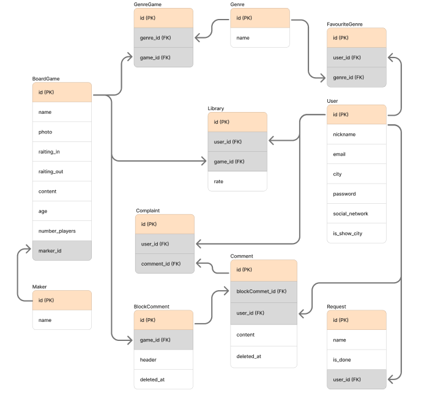

# 🎲 BerloGA -  форум для любителей настольных игр

Игроки часто сталкиваются с проблемой выбора настольной игры, которая бы соответствовала индивидуальным предпочтениям по сюжету, механике и сложности. Кроме того, документация по правилам часто бывает неполной, что приводит к неразрешенным вопросам во время игры. А также сложно найти людей для организации оффлайн-встречи для совместной игры в своем городе.  

Платформа **"BerloGA"** предлагает решение этих проблем. Пользователи формируют личные библиотеки с оценками, а лента рекомендаций формируется на основе интересов друзей с похожими предпочтениями. К описанию каждой игры прикреплен раздел комментариев для вопросов по правилам. Функция геолокационного поиска облегчает нахождение партнеров для игр в своем городе.  

👀 **Целевая аудитория** - любители настольных игр

## ⚙️ Стек технологий

| Слой | Технологии |
|-|--------|
| Frontend | React, TypeScript, React Router, Tailwind CSS |
| Backend | Node.js |
| База данных | PostgreSGL |
| Документация | Swagger |
| Тесты | Jest |
| Дизайн | Figma: [ссылка на дизайн](https://www.figma.com/design/nrzqOVvLF1e915dgc4X6DE/BerloGA?node-id=0-1&t=QlNAoPxAVFG8gsdk-1) |

## 💻 Ключевые экраны и функциональность

Для игрока (роль: user)
| Экран | Функционал |
|-------|--------|
| Главная | Лента настольных игр: сортировка, поиск  |
| Карточка настольной игры | Информация о игре, рейтинг, жанр, раздел с комментариями, а также возможность добавления игры в библиотеку  |
| Библиотека игр пользователя | Список настольных игр с личной оценкой пользователя, а также возможностью оставить заявку на добавление игры  |
| Профиль | Информация о пользователе, редактирование профиля, изменение пароля  |
| Друзья | Список пользователей, которые были добавлены в друзья  |
| Список пользователей | Список пользователей форум с возможностью фильтрации по городам  |

Для администратора (роль: admin)
| Экран | Функционал |
|-------|--------|
| Дашборд | Статистика активности пользователей: сколько игр добавлено в библиотеку за неделю/месяц, количество новых добавленных игр в систему за неделю/месяц  |
| Admin-панель | Управление пользователями и играми  |

## 🔥 Уникальные фичи
1.  Формирование ленты, опираясь на друзей и личные предпочтения пользователя, указанные в его профиле
2.	Поиск игроков в своей городе для оффлайн-встречи. У каждого пользователя в профиле есть поле, связанное с геолокацией и желанием оффлайн-игры.
3.	Расширенный каталог игр (получение списка игр через API)
4.	Система комментариев: возможность оставить вопрос по правилам игры

## Сущности системы
### Связи между сущностями
-	У одной игры может быть много жанров, и один жанр может принадлежать нескольким играм **(многие-ко-многим)**
-	У одного пользователя может быть несколько любимых жанров, и один жанр может быть любимым у нескольких пользователей **(многие-ко-многим)**
-	Один пользователь может любить много игр, и одна игра может нравиться нескольким пользователям **(многие-ко-многим – Library)**
-	У одной настольной игры может быть одно издательство, но один издатель может создать много игр **(один-ко-многим)**

### ERD-диаграмма
   
[Описание полей сущностей](doc/descriptionAttributes.md)

## Пользовательские сценарии
Главные пользовательские сценарии взаимодействия пользователя с системой:  
- Поиск настольной игры
-	Поиск игроков для оффлайн-встречи
-	Публикация вопроса по правилам игры
-	Управление библиотекой

Сценарий взаимодействия администратора с системой:  
- Управление пользователями
-	Обработка заявки на добавление игры

## Список эндпойнтов для API
**BoardGame**
| Адрес запроса | Метод запроса | Параметры запроса | Необходимая роль | Описание |
|---------------|---------------|-------------------|------------------|----------|
| /boardgame/all | GET | **cursor** (в какого индекса необходимо вывести значения), **limit** (сколько значений нужно вернуть), **filter** (необходимые фильтры для значений) | user | Получение списка всех настольных игр в ленту |
| /boardgame/{id} | GET | - | user | Получение информации по конкретной настольной игре |
| /boardgame/{id} | POST | Вся информация о новой настольной игре | admin | Добавление настольной игры |
| /boardgame/{id} | PATCH | Поля, которые необходимо изменить, и их новое значение | admin | Изменение информации о настольной игре |
| /boardgame/{id} | DELETE | - | admin | Удаление настольной игры |

**Library**
| Адрес запроса | Метод запроса | Параметры запроса | Необходимая роль | Описание |
|---------------|---------------|-------------------|------------------|----------|
| /library | GET | - | user | Получение списка настольных игр, которые входят в библиотеку текущего пользователя |
| /library/{game_id} | POST | Оценка новой настольной игры в библиотеке | user | Добавление настольной игры в библиотеку |
| /library/{game_id} | PATCH | Новая оценка настольной игры | user | Изменение оценки настольной игры |
| /library/{game_id} | DELETE | - | user | Удаление настольной игры из библиотеки |

**Genre**
| Адрес запроса | Метод запроса | Параметры запроса | Необходимая роль | Описание |
|---------------|---------------|-------------------|------------------|----------|
| /genre/all | GET | - | user | Получение полного списка жанров настольных игр |
| /genre | POST | Наименование нового жанра игры | admin | Добавление нового жанра настольных игр |
| /genre/{game_id} | POST | Список жанров настольной игры | admin | Добавление жанров к настольной игре |
| /genre/{id} | DELETE | - | admin | Удаление жанра настольных игр |
| /genre/{game_id}/all | GET | - | user | Получение списка жанров конкретной настольной игры |
| /genre/{game_id} | POST | Жанры настольной игры | admin | Присваивание жанров к конкретной настольной игре |
| /genre/{game_id} | DELETE | Жанры настольной игры | admin | Удаление жанров конкретной настольной игры |

**Marker**
| Адрес запроса | Метод запроса | Параметры запроса | Необходимая роль | Описание |
|---------------|---------------|-------------------|------------------|----------|
| /marker/all | GET | - | user | Получение полного списка создателей настольных игр |
| /marker | POST | Наименование нового создателя игры | admin | Добавление нового создателя настольных игр |
| /marker/{id} | DELETE | - | admin | Удаление создателя настольных игр |

**Request**
| Адрес запроса | Метод запроса | Параметры запроса | Необходимая роль | Описание |
|---------------|---------------|-------------------|------------------|----------|
| /request | POST | name (название настольной игры) | user | Создание заявки на добавление настольной игры |
| /request | GET | - | user | Получение списка заявков пользователя |
| /request/all | GET | - | admin | Получение списка заявков |
| /request/{id} | PATCH | status (новый статус для заявки) | admin | Изменение статуса заявки |

**User**
| Адрес запроса | Метод запроса | Параметры запроса | Необходимая роль | Описание |
|---------------|---------------|-------------------|------------------|----------|
| /user | GET | - | user | Получение информации о пользователе |
| /user | PATCH | Поля, которые необходимо изменить, и их новое значение | user | Изменение информации о пользователе |
| /user | DELETE | - | user | Удаление аккаунта |

**Favourite**
| Адрес запроса | Метод запроса | Параметры запроса | Необходимая роль | Описание |
|---------------|---------------|-------------------|------------------|----------|
| /favourite/genre | GET | - | user | Получение информации о любимых жанрах пользователя |
| /favourite/genre | POST | Cписок жанров | user | Добавление информации о любимых жанрах пользователя |
| /favourite/genre/{genre_id} | DELETE | - | user | Удаление жанра из списка любимых жанров пользователя |
| /favourite/user | GET | - | user | Получение информации о подписках пользователя |
| /favourite/user/{user_id} | POST | - | user | Подписка пользователя на другого пользователя |
| /favourite/user/{user_id} | DELETE | - | user | Отмена подписки пользователя на другого пользователя |

**Comment**
| Адрес запроса | Метод запроса | Параметры запроса | Необходимая роль | Описание |
|---------------|---------------|-------------------|------------------|----------|
| /comment/{game_id}/all | GET | - | user | Получение всех комментариев конкретной игры |
| /comment/{game_id} | POST | Если необходимо, отправить id блока, к которому нужно добавить комментарий | user | Публикация комментария |
| /comment/{id} | DELETE | - | admin | Удаление комментария |

**Complaint**
| Адрес запроса | Метод запроса | Параметры запроса | Необходимая роль | Описание |
|---------------|---------------|-------------------|------------------|----------|
| /complaint/all | GET | - | admin | Получение всех жалоб |
| /complaint | GET | - | user | Получение жалоб текущего пользователя |
| /complaint | POST | id комментария | user | Отправить жалобу на комментарий |

## 📋 Планирование разработки проекта
#### 1. Идея и план *(до 10 мая)* 
   - [x] Описание идеи
   - [x] ER-диаграмма ( черновик )
   - [ ] BPNM для главных процессов системы (user: поиск настольной игры, управление библиотекой; admin: добавление настольной игры)
   - [x] Список экранов
#### 2. Проектирование системы *(до 24 мая)*
   - [ ] Макеты ключевых экранов в Figma
   - [ ] ER-диаграмма (итоговый вариант)
   - [ ] Список эндпойнтов API
   - [ ] Структура папок проекта (фронт и бэк)
   - [ ] Базовые компоненты и роутинг со стороны фронтенда
#### 3. Бэкенд и база данных *(до 7 июня)*
   - [ ] Создание базы данных
   - [ ] Реализация авторизации пользователя
   - [ ] Реализация базовых эндпоинтов
   - [ ] Оформление конфигурации в .env
#### 4. Связка фронта с бэком (MVP) *(до 21 июня)*
   - [ ] Фронт подключен к бэку, данные приходят из БД
   - [ ] Реализация CRUD для ключевых сущностей
   - [ ] Работа регистрации, входа в систему, профиль
   - [ ] Обработка ошибок на стороне фронта
#### 5. Доработка всего функционала *(до 3 июля)*
   - [ ] Написание тестов
   - [ ] Оформление README c инструкцией запуска
   - [ ] Обработка ошибок везде
   - [ ] Подготовка презентации
