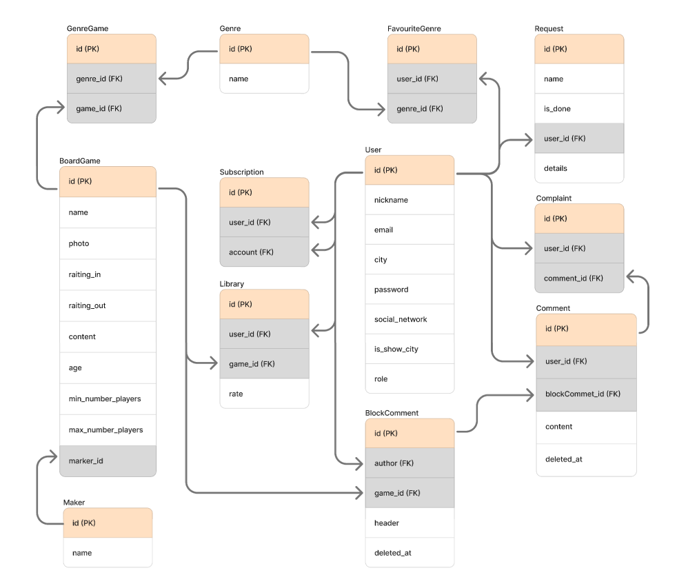

# 🎲 BerloGA -  форум для любителей настольных игр

Игроки часто сталкиваются с проблемой выбора настольной игры, которая бы соответствовала индивидуальным предпочтениям по сюжету, механике и сложности. Кроме того, документация по правилам часто бывает неполной, что приводит к неразрешенным вопросам во время игры. А также сложно найти людей для организации оффлайн-встречи для совместной игры в своем городе.  

Платформа **"BerloGA"** предлагает решение этих проблем. Пользователи формируют личные библиотеки с оценками, а лента рекомендаций формируется на основе интересов друзей с похожими предпочтениями. К описанию каждой игры прикреплен раздел комментариев для вопросов по правилам. Функция геолокационного поиска облегчает нахождение партнеров для игр в своем городе.  

👀 **Целевая аудитория** - любители настольных игр

## 📄 Содержание
- [Стек технологий](#%EF%B8%8F-стек-технологий)
- [Ключевые экраны](#-ключевые-экраны-и-функциональность)
- [Уникальные фичи](#-уникальные-фичи)
- [Сущности системы](#сущности-системы)
- [Пользовательские сценарии](#пользовательские-сценарии)
- [Список эндпойнтов](#список-эндпойнтов-для-api)
- [Планирование разработки](#-планирование-разработки-проекта)
- [Структура папок](#-структура-папок-проекта)

## ⚙️ Стек технологий

| Слой | Технологии |
|-|--------|
| Frontend | React, TypeScript, React Router, Tailwind CSS |
| Backend | Node.js |
| База данных | PostgreSGL |
| Документация | Swagger |
| Тесты | Jest |
| Дизайн | Figma: [ссылка на дизайн](https://www.figma.com/design/nrzqOVvLF1e915dgc4X6DE/BerloGA?node-id=0-1&t=QlNAoPxAVFG8gsdk-1) |

## 💻 Ключевые экраны и функциональность

Для игрока (роль: user)
| Экран | Функционал |
|-------|--------|
| Главная | Лента настольных игр: сортировка, поиск  |
| Карточка настольной игры | Информация о игре, рейтинг, жанр, раздел с комментариями, а также возможность добавления игры в библиотеку  |
| Библиотека игр пользователя | Список настольных игр с личной оценкой пользователя, а также возможностью оставить заявку на добавление игры  |
| Профиль | Информация о пользователе, редактирование профиля, изменение пароля  |
| Друзья | Список пользователей, которые были добавлены в друзья  |
| Список пользователей | Список пользователей форум с возможностью фильтрации по городам  |

Для администратора (роль: admin)
| Экран | Функционал |
|-------|--------|
| Дашборд | Статистика активности пользователей: сколько игр добавлено в библиотеку за неделю/месяц, количество новых добавленных игр в систему за неделю/месяц  |
| Admin-панель | Управление пользователями и играми  |

## 🔥 Уникальные фичи
1.  Формирование ленты, опираясь на друзей и личные предпочтения пользователя, указанные в его профиле
2.	Поиск игроков в своей городе для оффлайн-встречи. У каждого пользователя в профиле есть поле, связанное с геолокацией и желанием оффлайн-игры.
3.	Расширенный каталог игр (получение списка игр через API)
4.	Система комментариев: возможность оставить вопрос по правилам игры

## Сущности системы
### Связи между сущностями
-	У одной игры может быть много жанров, и один жанр может принадлежать нескольким играм **(многие-ко-многим)**
-	У одного пользователя может быть несколько любимых жанров, и один жанр может быть любимым у нескольких пользователей **(многие-ко-многим)**
-	Один пользователь может любить много игр, и одна игра может нравиться нескольким пользователям **(многие-ко-многим – Library)**
-	У одной настольной игры может быть одно издательство, но один издатель может создать много игр **(один-ко-многим)**

### ER-диаграмма
   
[Описание полей сущностей](doc/descriptionAttributes.md)

## Пользовательские сценарии
1. Как **пользователь**, я хочу **искать настольные игры**, чтобы находить новые игры по мои интересам или по определенным фильтрам.
2. Как **пользователь**, я хочу **искать игроков**, чтобы встречаться с нимим в моем городе для оффлайн-игр.
3. Как **пользователь**, я хочу **оставлять комментарий** под настольной игрой, чтобы уточнить правила игры или любой другой интересующий вопрос.
4. Как **пользователь**, я хочу **управлять своей библиотекой**, чтобы сохранить свои настольные игры, ставить им оценки и искать похожие игры.
5. Как **администратор**, я хочу **управлять пользователями** приложения, чтобы блокировать недоброжелатей.
6. Как **администратор**, я хочу **обрабатывать заявки**, чтобы доблять игры, которые интересуют пользователей
---
### [Список эндпойнтов для API](doc/api-endpoints.md)
---

## 📋 Планирование разработки проекта
[Kanban-доска](https://www.figma.com/board/0AWmstyFBKGrirJU6iWmLB/Esoft.-%D0%98%D1%82%D0%BE%D0%B3%D0%BE%D0%B2%D1%8B%D0%B9-%D0%BF%D1%80%D0%BE%D0%B5%D0%BA%D1%82?node-id=0-1&t=Tia4bP3761TE63WH-1)
#### 1. Идея и план *(до 10 мая)* 
   - [x] Описание идеи
   - [x] ER-диаграмма ( черновик )
   - [ ] BPNM для главных процессов системы (user: поиск настольной игры, управление библиотекой; admin: добавление настольной игры)
   - [x] Список экранов
#### 2. Проектирование системы *(до 24 мая)*
   - [x] Макеты ключевых экранов в Figma
   - [x] ER-диаграмма (итоговый вариант)
   - [x] Список эндпойнтов API
   - [x] Структура папок проекта (фронт и бэк)
   - [x] Базовые компоненты и роутинг со стороны фронтенда
#### 3. Бэкенд и база данных *(до 7 июня)*
   - [ ] Создание базы данных
   - [ ] Реализация авторизации пользователя
   - [ ] Реализация базовых эндпоинтов
   - [ ] Оформление конфигурации в .env
#### 4. Связка фронта с бэком (MVP) *(до 21 июня)*
   - [ ] Фронт подключен к бэку, данные приходят из БД
   - [ ] Реализация CRUD для ключевых сущностей
   - [ ] Работа регистрации, входа в систему, профиль
   - [ ] Обработка ошибок на стороне фронта
#### 5. Доработка всего функционала *(до 3 июля)*
   - [ ] Написание тестов
   - [ ] Оформление README c инструкцией запуска
   - [ ] Обработка ошибок везде
   - [ ] Подготовка презентации

## 📁 Структура папок проекта

```
berloga/
├── packages/
│   ├── client/
│   │   ├── src/
│   │   │   ├── pages/          # Страницы приложения
│   │   │   ├── components/     # Переиспользуемые компоненты
│   │   │   ├── stores/         # Zustand stores
│   │   │   ├── api/            # Axios-клиент и запросы
│   │   │   ├── types/          # TypeScript типы
│   │   │   ├── utils/          # Утилиты
│   │   │   └── validations/    # Валидация для полей в формах
│   │   └── ...
│   ├── backend/
│   │   ├── src/
│   │   │   ├── routes/         # Express роуты
│   │   │   ├── controllers/    # Контроллеры
│   │   │   ├── services/       # Бизнес-логика
│   │   │   ├── middleware/     # Auth, validation, roles
│   │   │   ├── models/         # Schema + migrations
│   │   │   └── utils/          # Утилиты (mail, tokens)
│   │   └── ...
│   └── ...
├── docker-compose.yml
└── README.md
```
